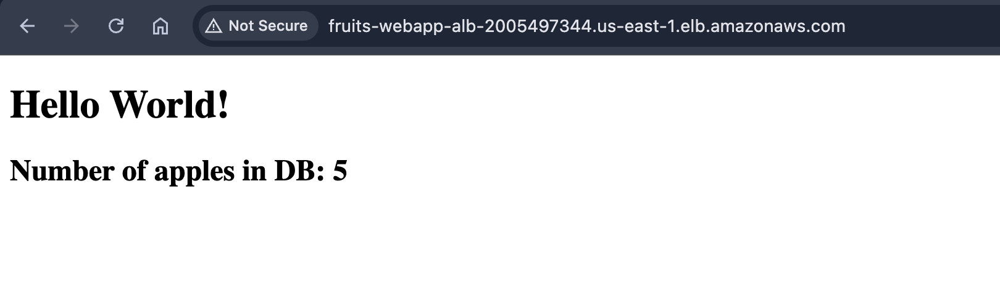
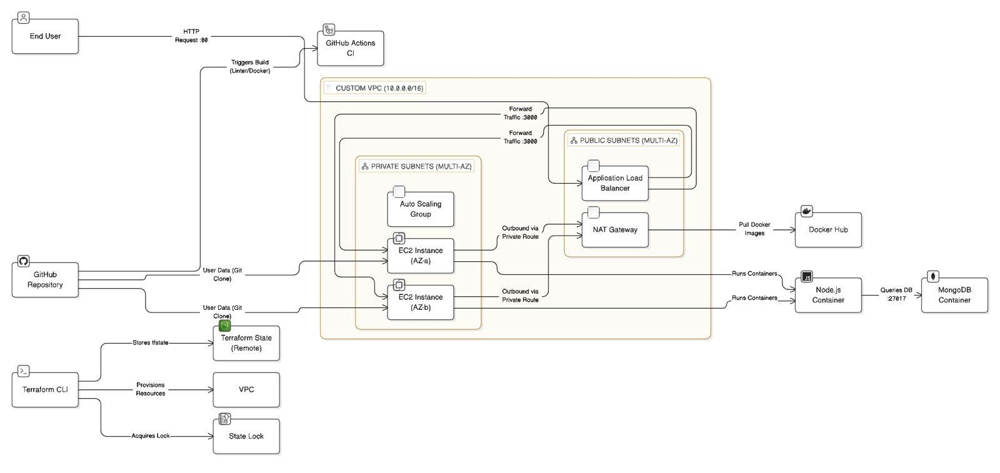

# Fruits Webapp


A comprehensive infrastructure-as-code (IaC) and containerized application project designed to provision a highly available web application serving data from a MongoDB database.

## 🏗️ Architecture Overview



The system architecture is designed with modern DevOps principles, utilizing containerization and dynamic cloud infrastructure provisioning:

- **Application Layer**: A lightweight Express.js Node application.
- **Database Layer**: MongoDB, pre-seeded with fruit data on initialization.
- **Containerization**: Both the Application and Database run in isolated Docker containers, orchestrated via Docker Compose on a custom bridge network.
- **Infrastructure (AWS)**: 
  - **VPC & Networking**: A custom VPC with public subnets for the load balancer and private subnets for the application instances. A NAT Gateway provides secure outbound internet access for the private instances.
  - **Auto Scaling Group (ASG)**: Ensures high availability by maintaining 2 EC2 instances spread across 2 Availability Zones.
  - **Application Load Balancer (ALB)**: Situated in the public subnets to route incoming HTTP traffic to the instances in the private subnets.
  - **Terraform State Management**: Remote state stored securely in an Amazon S3 bucket, with state locking managed by an Amazon DynamoDB table.
- **CI/CD**: GitHub Actions pipeline defined to automatically lint and build Docker images on every push or pull request to main/feature branches.

## 🚀 Quick Start (Local Development)

To run the application locally, you only need Docker installed.

1. Clone the repository:
   ```bash
   git clone https://github.com/omerbeithalahmy/fruits-webapp.git
   cd fruits-webapp
   ```

2. Run the provisioning script:
   ```bash
   ./scripts/provision_local.sh
   ```
   *Note: This script builds the Docker images, starts the containers, and handles the initial database seeding.*

3. Open your browser and navigate to:
   ```
   http://localhost:3000
   ```
   You should see a page displaying the "Hello World!" message along with the current count of apples fetched directly from the MongoDB database.

   You can also verify the service health via the newly added health check endpoint:
   ```
   http://localhost:3000/health
   ```

## ☁️ Cloud Provisioning (AWS via Terraform)

The infrastructure can be fully deployed to AWS using the provided Terraform configuration.

### Prerequisites
- AWS CLI configured with appropriate credentials.
- Terraform installed locally.

### Deployment Steps

We have provided automation scripts to make cloud provisioning completely seamless.

1. **Initialize the Backend**:
   First, provision the S3 bucket and DynamoDB table required for remote state locking.
   ```bash
   ./scripts/deploy_backend.sh
   ```

2. **Deploy the Infrastructure**:
   This script will automatically detect your AWS Account ID, connect to the secure backend, and deploy the VPC, Security Groups, ALB, and Auto Scaling Group.
   ```bash
   ./scripts/deploy_infra.sh
   ```

3. **Access the Application**:
   Once applied, Terraform will output the `alb_dns_name`. Navigate to this URL in your browser to view the live application.

```

## 🛠️ Technology Stack
- **Backend & API**: Node.js (Express)
- **Database**: MongoDB (v7.0)
- **Containerization**: Docker & Docker Compose
- **Infrastructure as Code**: Terraform
- **Cloud Provider**: Amazon Web Services (EC2, ALB, ASG, S3, DynamoDB)
- **Continuous Integration**: GitHub Actions
